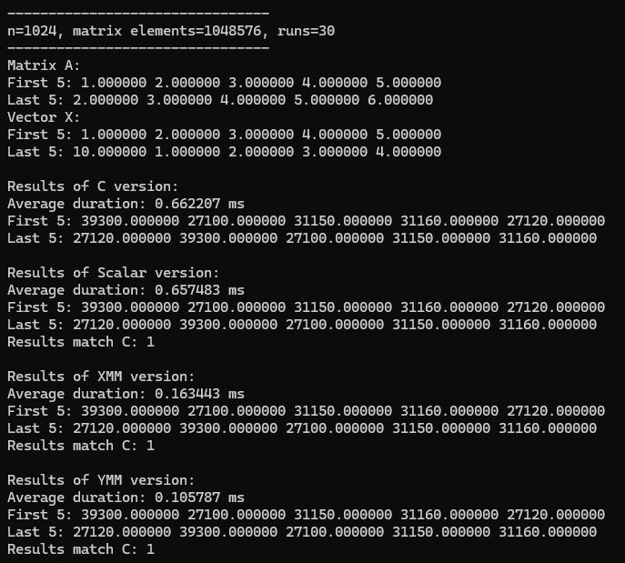
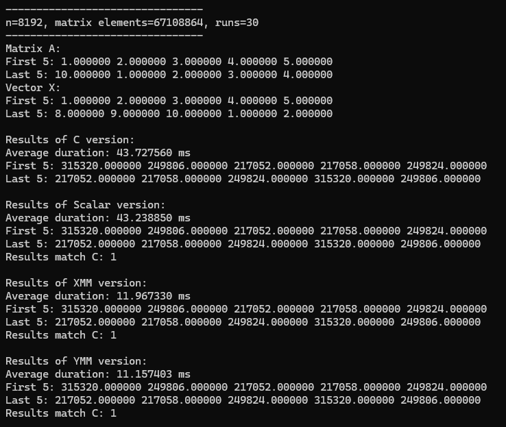
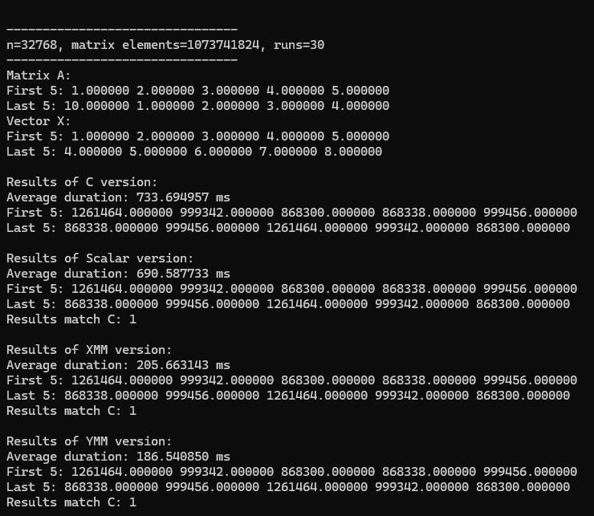
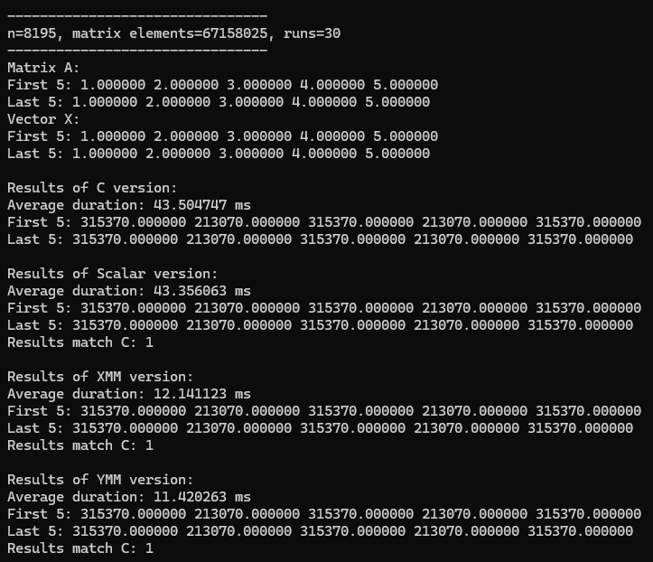

# Deep Dive SIMD Programming Project
Group #5

Members:
- Julian Johan Briones
- Ramon John Dela Cruz
- Anthony Andrei Tan

## Screenshot of program output with execution time and correctness check (n = 2^10; 2^20 total elements)

## Screenshot of program output with execution time and correctness check (n = 2^13; 2^26 total elements)

## Screenshot of program output with execution time and correctness check (n = 2^15; 2^30 total elements)

## Screenshot of program output with execution time and correctness check (n = 2^13 + 3; boundary check: n % 4 = 3, n % 8 = 3)

## viii. Analysis of Results Across Platforms
At n = 1,024, YMM finishes only 0.551 ms ahead of scalar execution. Increasing matrix size to n = 8,192 widens this margin to 32.082 ms as scalar processing time climbs to 43.239 ms. At the maximum dimension of n = 32,768, the absolute time saved expands dramatically: YMM finishes 504.047 ms faster than scalar execution and outpaces the 128-bit XMM kernel by an additional 19.122 ms. Because total arithmetic operations scale quadratically, the real-world efficiency of 256-bit SIMD registers compounds as dimensions increase, eliminating over half a second per execution on large matrices. This means that the size is directly proportional to the result in differences as the comparison just keeps increasing from there.

## ix. Problems Encountered and Solutions Made
When implementing matvec_scalar.asm, a problem encountered is managing the Windows x64 calling convention, where only the first four arguments reside in registers and the fifth argument for vector Y must be correctly retrieved from stack memory at [rsp + 40]. Another frequent challenge is converting and analyzing two-dimensional matrix indexing into assembly without recalculating row-major offsets on every iteration. Instead of executing repeated multiplication instructions for row offsets, the inner loop was simplified to advance the matrix pointer sequentially by 4 bytes per float. Finally, coordinating nested row and column loops required proper register management to ensure the floating-point accumulator properly cleared to zero before computing each subsequent row dot product.
